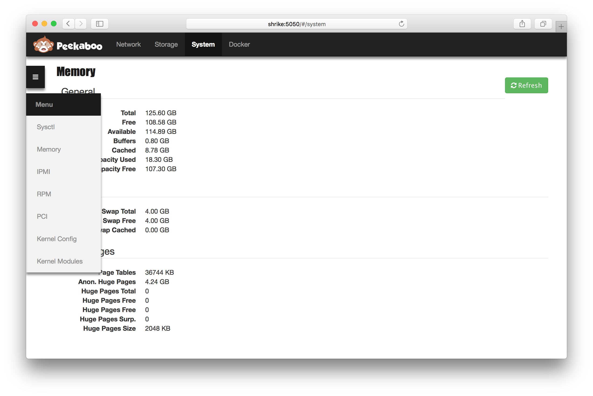

<p align="center">
  
</p>

Expose hardware info using a REST API written in Go and a Front-End written in AngularJS.


## FrontEnd

```
http://myserver.example.com:5050
```

<p align="center">
  
</p>

## BackEnd

### Endpoints

```
/api/docker
/api/docker/containers
/api/docker/images
/api/network/interfaces
/api/network/routes
/api/storage/disks
/api/storage/lvm/logvols
/api/storage/lvm/physvols
/api/storage/lvm/volgrps
/api/storage/mounts
/api/system
/api/system/cpu
/api/system/ipmi
/api/system/kernelcfg
/api/system/memory
/api/system/os
/api/system/pcicards
/api/system/rpms
/api/system/sysctls
```

### Methods

**GET**

```
curl -i -X GET http://<host>:<port>/api/system?envelope=true
```

**PURGE**

Purge cache i.e. next get request will refresh the cache.

```
curl -i -X PURGE http://<host>:<port>/api/system?envelope=true
```

### Options

**envelope**

Include an envelope with error, cache and status information.

```
?envelope=true
```

**Example:**

```json
{
  "cache": {
    "lastUpdated": "...",
    "timeoutSec": 0,
    "fromCache": false
  },
  "data": {
  },
  "error": [],
  "status": 200
}
```

**refresh**

Refresh cache.

```
?refresh=true
```

**indent**

Don't indent JSON.

```
?indent=false
```

**Example:**

```bash
curl http://myserver.example.com:5050/api/system
```

# Usage

```bash
Peekaboo

Usage:
  peekaboo daemon [--debug] [--bind=<addr>] [--static=<dir>]
  peekaboo list
  peekaboo get <hardware-type>
  peekaboo -h | --help
  peekaboo --version

Commands:
  daemon               Start as a daemon serving HTTP requests.
  list                 List hardware names available.
  get                  Return information about hardware.

Arguments:
  hardware-type        Name of hardware to return information about.

Options:
  -h --help            Show this screen.
  --version            Show version.
  -d --debug           Debug.
  -b --bind=<addr>     Bind to address and port. [default: 0.0.0.0:5050]
  -s --static=<dir>    Directory for static content. [default: static]
```

# Setup Go on Linux

```bash
sudo yum install -y golang
mkdir ~/go
export GOPATH=~/go
export PATH=$GOPATH/bin:$PATH
go get github.com/constabulary/gb/...
```

## Build and run

```bash
gb build
sudo bin/peekaboo daemon -d
```

## Build RPM

Fiest make sure you have Docker configured.

```bash
make rpm
```

## Change configuration

```bash
systemctl stop peekaboo
vi /etc/sysconfig/peekaboo
```

Change port to 8080.

**Example:**

```
OPTIONS="--bind 0.0.0.0:8080"
```

Reload SystemD and then restart Peekaboo.

```bash
systemctl start peekaboo
```

## Install using Brew on Mac OS X

```bash
brew tap mickep76/funk-gnarge
brew install peekaboo
ln -sfv /usr/local/opt/peekaboo/*.plist ~/Library/LaunchAgents
launchctl load ~/Library/LaunchAgents/homebrew.mxcl.peekaboo.plist
```

## Change configuration

```bash
launchctl unload ~/Library/LaunchAgents/homebrew.mxcl.peekaboo.plist
vi ~/Library/LaunchAgents/homebrew.mxcl.peekaboo.plist
```

Change port to 8080.

**Example:**

```
...
    <string>--bind</string>
    <string>0.0.0.0:8080</string>
..
```

Restart Peekaboo.

```bash
launchctl load ~/Library/LaunchAgents/homebrew.mxcl.peekaboo.plist
```
